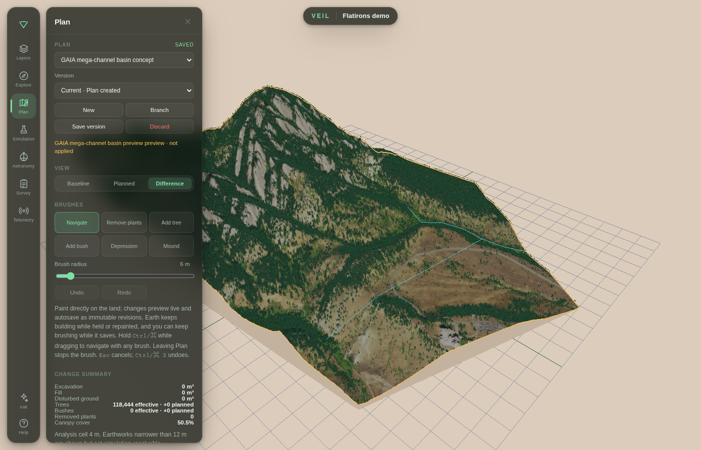
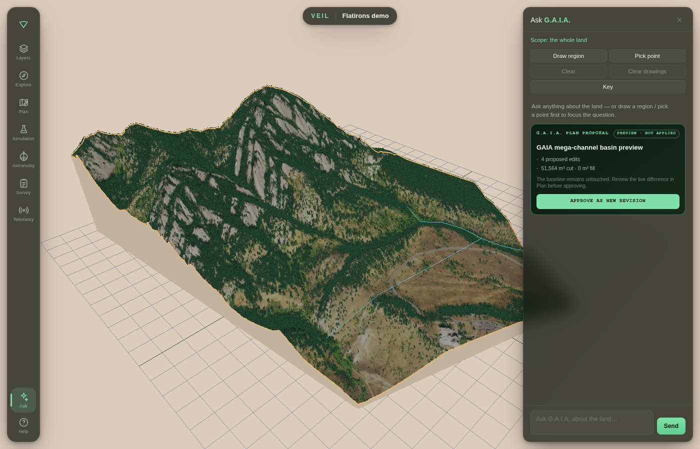
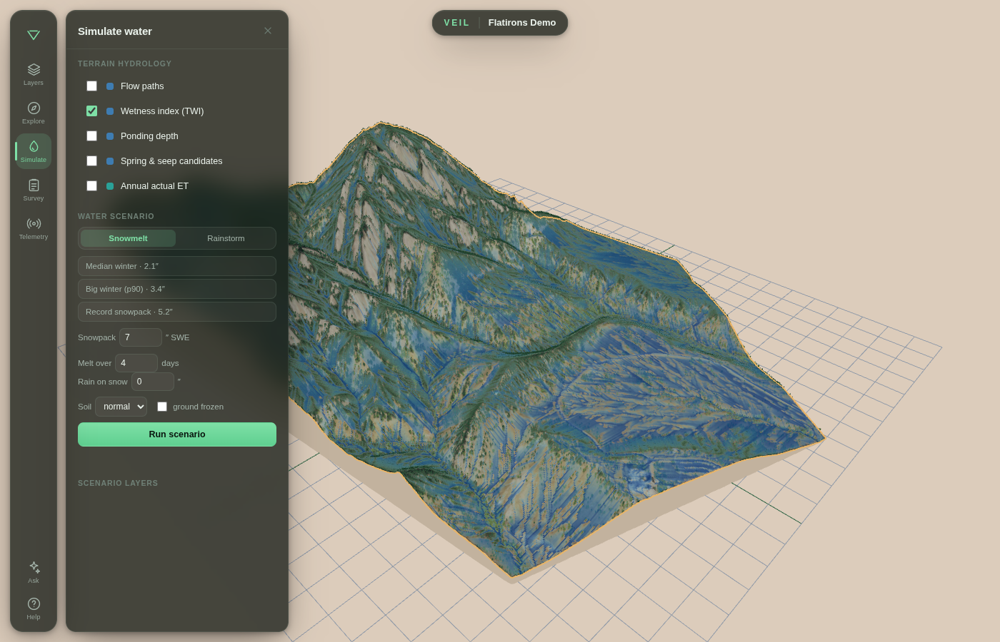
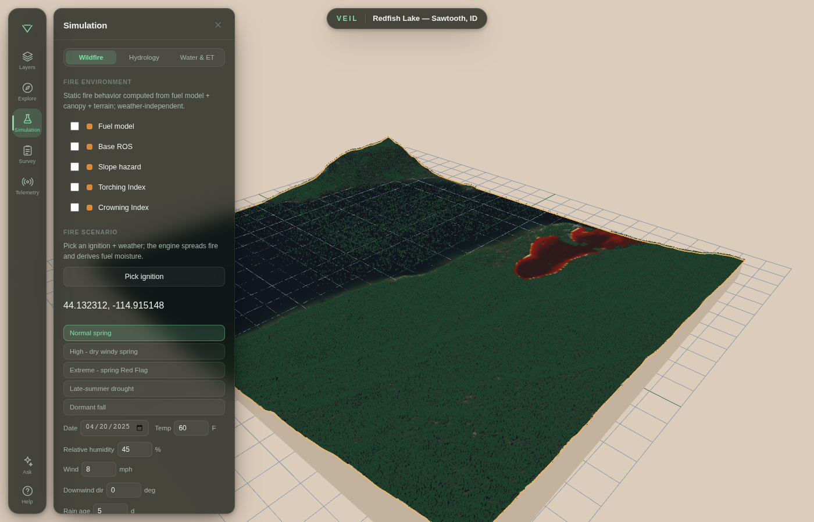
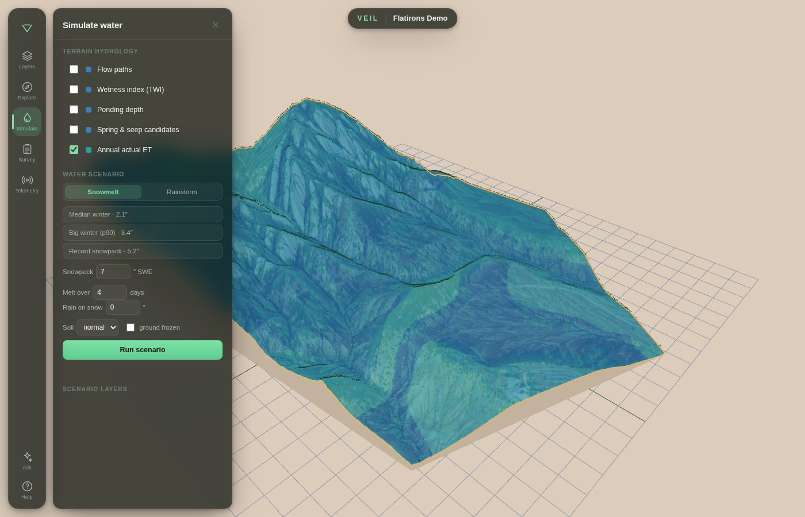
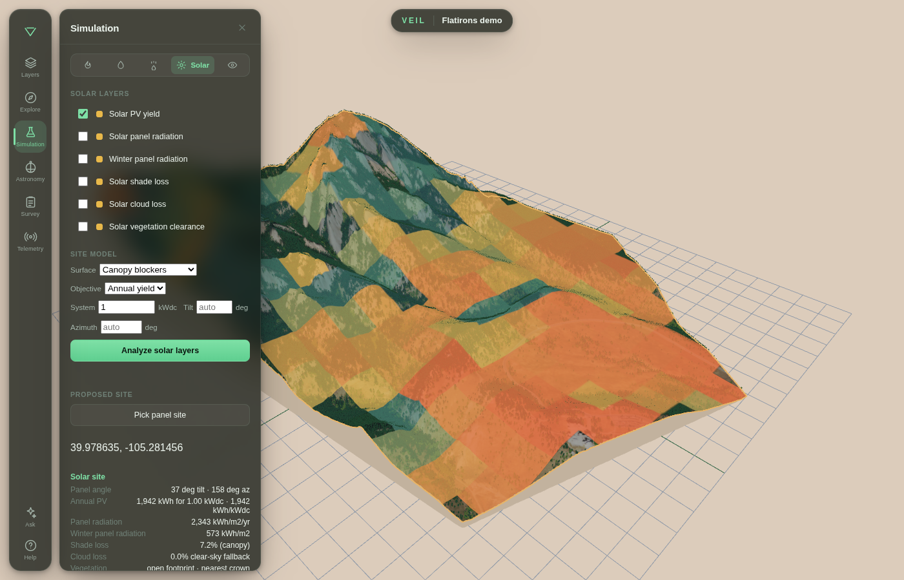
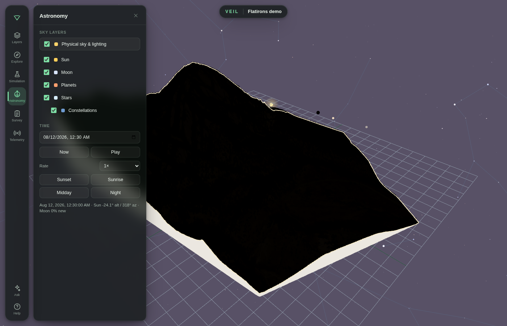
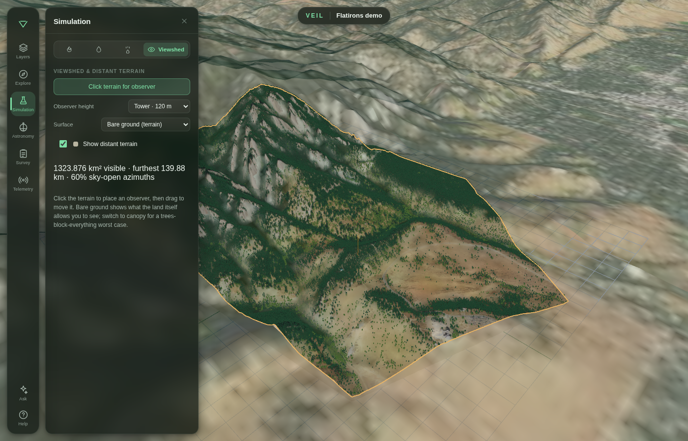

# Mazzap v2 — a georeferenced 3D digital-twin engine


https://github.com/user-attachments/assets/deb9e860-abf8-4e34-ab9b-88b3c7a2643f


Mazzap v2 turns a patch of real ground into a **VEIL — a Virtually Embodied
Intelligent Land**: a standalone, fully **georeferenced** 3D digital twin that
Mazzap models and instantiates from open geospatial data. Open it in a browser,
click to read true GPS coordinates, drape your own map layers onto the terrain,
**simulate** the processes that move water and fire across it, and ask questions
about it in natural language.

No database, no cloud, no build step at view time: one tiny zero-dependency Node
static server serves a Three.js viewer over a self-contained bundle of geospatial
data. Nothing is fetched from the network when you view it.

```bash
# A fresh clone ships the engine, not a place — build a twin first:
npm run demo       # build the bundled Flatirons demo twin (needs internet + GDAL)
npm run serve-demo # -> http://127.0.0.1:4174

# ...or build your own area interactively, then serve it:
npm run init       # guided setup: draw an AOI, fetch data, build the twin
npm start          # -> http://127.0.0.1:4173
```

(`npm start` with no twin built yet just tells you to run one of the above.)

Requires Node ≥ 18 (the server uses the built-in `fetch`); the data pipeline
scripts need Python 3 with GDAL (`osgeo`), numpy, pyproj, and Pillow. The
MCP/chat path also needs the Python `mcp` SDK from `requirements.txt`. If you'd
rather not assemble that toolchain yourself, **[run it in a container](#run-with-docker)** —
GDAL, numpy, Node, and the rest come pinned and pre-built.

Point it at **your own** DEM and imagery (see "Build your own twin" below) — the
engine is region-agnostic. The coordinate system, the vegetation knowledge, the
map-layer styling, and any source-acquisition scripts all live in data and in an
optional **regional pack**, never hardcoded in the engine.

## What you get

- **3D terrain** from any DEM (a LiDAR DTM, USGS 3DEP, a national survey grid),
  rendered as a lit mesh with selectable surface modes (aerial / false-color /
  hillshade / elevation).
- **Aerial imagery** draped on the terrain, aligned to the grid so it conforms
  to the topography instead of floating.
- **Click-to-identify + GPS readout** — click anywhere to pin the real-world
  lat/lon (validated against proj4js), elevation, and every map feature true at
  that spot.
- **Atlas layers** — import any vector or raster geospatial file and it is
  reprojected to the scene, clipped to the terrain footprint, auto-styled, and
  made clickable. Bring soils, wetlands, zoning, habitat, hydrology, land cover —
  whatever you have.
- **Vegetation** — a capability ladder that derives trees from the best signal
  available (LiDAR segmentation stems, a canopy-height model, or an NDVI canopy),
  rendered as low-LOD 3D forms. Anywhere in the continental US, the bundled
  **`us-national`** pack types them evergreen/deciduous and names their
  community from LANDFIRE — no regional setup (see "Vegetation" under
  [docs/make-a-twin.md](docs/make-a-twin.md)).
- **Simulation** — model the processes that move across the land, not just what's
  on it: terrain **hydrology** (flow, wetness, ponding, seeps, and snowmelt/storm
  runoff scenarios), **evapotranspiration & water balance** (FAO-56 reference and
  actual ET, closing the land's water budget), **wildfire** behavior scenarios,
  and **solar siting** (panel radiation, PV yield, shade/cloud losses, and angle
  recommendations). Each renders as draped, clickable layers in the viewer's Simulation
  window, and is honest about its uncertainty. See ["Simulation"](#simulation).
- **Solar panel planning** — combine astronomy, viewshed horizons, and Daymet
  climate normals to rank panel sites, answer proposed-site questions, and
  visualize annual/winter PV potential. See ["Solar siting"](#solar-siting).
- **Astronomy** — a local ephemeris-driven sky, lighting model, and time scrubber
  for sun, moon, planets, stars, constellations, eclipses, rise/set, golden hour,
  and terrain-aware solar context. See ["Astronomy"](#astronomy).
- **Viewshed & distant terrain** — compute what is visible from an observer point,
  rank viewpoints, query visibility through MCP, and render 3DEP distant terrain
  with NAIP drapes around the twin. See ["Viewshed & distant terrain"](#viewshed--distant-terrain).
- **Ask the land chat** — a collapsible panel that talks to an LLM wired to the
  twin's read-only query tools (the MCP server), scoped to the whole twin, a
  polygon you draw, or a point you pick. See [docs/mcp.md](docs/mcp.md).
- **QField survey companion** — generate a QField project from the active twin,
  collect trails / stream centerlines / photo points / observations in the
  field, then upload the zipped project folder back through the viewer. Uploads
  become journaled `survey_*` entities, rendered as survey layers and queryable
  through MCP. See [docs/survey.md](docs/survey.md).
- **Live telemetry** — register Meshtastic/LoRa gateways from the viewer,
  render live tracker positions, replay recorded days with realtime/speed
  controls and tracker POV, then append selected samples into the curated twin
  store. See [docs/live-inputs.md](docs/live-inputs.md).
- **Nymph Manager** — a home for external devices, robots, and actuators. The
  first integration is the DJI Mini 4 Pro: a retained Mac flight process talks
  to the RC-N2 through the Android bridge, while a private Unix adapter exposes
  sanitized telemetry and explicit acknowledged controls to the browser. The
  console provides controller, guarded virtual-stick, and RTS click workflows,
  capability/interlock state, arm and route hold/resume controls, and unsent
  georeferenced RTS drafting with a scroll-controlled AGL ribbon. Raw HEVC video
  stays on the direct Android-to-Mac native-decoder path. See the
  [implemented bridge overview](docs/dji-mini4-bridge.md), durable
  [flight-planning implementation plan](docs/flight-planning-implementation-plan-v1.5.md)
  and [bridge contract](docs/bridge-contract.md).
- **Plan** — a smooth, interactive 3D workspace with live terrain/vegetation
  feedback for tree/shrub removal, free-text species-aware planting, and
  depressions/mounds. Hold Ctrl/Command to navigate without leaving a brush;
  G.A.I.A. composes swales, orchards, and gardens from the same primitives.
  Plans autosave as immutable revisions, support named versions and branches,
  can be safely discarded, and rerun hydrology, wildfire, ET, solar, and
  viewshed against the effective land. G.A.I.A. can draft and visualize proposals
  before an explicitly confirmed apply. See [docs/plan.md](docs/plan.md).

## Plan land alternatives

Plan is a non-destructive workspace for trying changes to the land before making
decisions in the field. The baseline twin never changes: each completed brush
gesture becomes an immutable plan revision, and every simulation result stays
scoped to the exact plan and revision that produced it.



### Use Plan by hand

1. Open **Plan** from the left rail, then click **New** or select an existing
   plan. Choose **Baseline**, **Planned**, or **Difference** at any time to
   compare the original land with the active alternative.
2. Select **Remove plants**, **Add tree**, **Add bush**, **Depression**, or
   **Mound**. Set brush radius and, where relevant, species, modeled stage,
   spacing, and earth depth/height. Click once to place a plant; drag to paint
   plantings or earthworks. The 3D terrain and vegetation update while you draw.
3. Hold **Ctrl** (or **Command** on macOS) while dragging to move the camera
   without leaving the brush. **Esc** cancels an unfinished gesture;
   **Ctrl/Command+Z** undoes the last completed one.
4. Watch the save indicator and change summary. Finished gestures autosave as
   immutable revisions, so **Save version** is for naming a checkpoint—not for
   protecting ordinary work. Select an older version to inspect or simulate it;
   use **Branch** to turn that read-only version into a new editable alternative.
   **Discard** archives the whole plan without deleting its revision history.
5. Open **Simulation** and run hydrology, wildfire, Water & ET, solar, or
   viewshed normally. With a plan selected, VEIL automatically runs against that
   revision's effective terrain and vegetation instead of the baseline.

### Plan with G.A.I.A.

1. Open **Ask G.A.I.A.** and describe the outcome and location—for example,
   “Draft a swale along the main flow path with a capture basin; show me the
   difference, but do not apply it.” Use **Draw region** or **Pick point** first
   when the request should be spatially constrained.
2. G.A.I.A. creates or extends a plan, validates its proposed edits, estimates
   quantities, and opens the proposal in the already-running viewer's
   **Difference** view. This is a preview: it does not alter the plan head or the
   baseline.
3. Inspect the live terrain, switch among **Baseline**, **Planned**, and
   **Difference**, and read the proposal quantities. Ask G.A.I.A. to revise the
   draft if needed. When it is right, click **Approve as new revision** (or give
   an equally explicit approval in chat). Approval creates one immutable
   revision; stale proposals are rejected rather than overwriting newer work.
4. Ask G.A.I.A. to run a plan simulation, or use the Simulation pane yourself,
   then compare results across saved versions or branches.



The detailed edit model, simulation coupling, REST endpoints, MCP tools, and
current limits are documented in [docs/plan.md](docs/plan.md).

## Simulation

Mapping shows what's *on* the land; **simulation** models the processes that move
*across* it. Mazzap runs these inside the viewer's collapsible **Simulation**
window, each rendered as draped, clickable layers that conform to the topography —
and each is explicit about what it can and cannot tell you.

### Hydrology

Mazzap models where water moves and pools across the land, in two tiers. **Tier 1**
(`analyze_hydrology.py`) works the bare LiDAR/DEM surface: priority-flood depression
filling, D8 flow direction with O(n) flow accumulation, Horn slope, and a
Topographic Wetness Index. It produces draped, clickable layers for flow paths
(upslope contributing area, ha), wetness index (TWI percentile), ponding depth in
closed depressions (m), and spring/seep candidates (wetness × flow convergence ×
slope-break × shallow restrictive layer from SSURGO soils). **Tier 2**
(`hydro_scenario.py`) runs event scenarios — snowmelt (inches of SWE over N melt
days, optional rain-on-snow, antecedent moisture, frozen ground) or a rainstorm
(depth over a duration) — partitioning each soil cell into runoff versus
infiltration via the SCS Curve-Number method (SSURGO hydrologic soil groups, AMC
I/II/III), then routing down the Tier-1 D8 graph for per-cell runoff, routed
event-flow volumes, and a peak-discharge estimate at the AOI outlet. Honest
framing: the geometry — *where* water concentrates — is the reliable output;
discharge magnitude carries a ±50% class band because the catchment is ungauged.



**Use cases:**
- **Agriculture** — locate wet-index hollows and ponding cells that drown crops or bog down equipment, to guide tile-drainage and field-traffic planning.
- **Ecology** — map spring/seep candidates and convergent flow paths that mark seasonal wetland and riparian habitat across the land.
- **Conservation** — target erosion-control and buffer plantings along the routed high-runoff channels a modeled storm concentrates.

### Wildfire

Mazzap runs fire-behavior scenarios on top of the LANDFIRE fuel layers a US VEIL
already carries — surface fuel models (FBFM13/40), canopy cover, height, base
height, and bulk density. Combined with the land's terrain (slope, aspect), local
hydrology influence, an ignition point, and a chosen weather/wind scenario, it
models arrival time, flame length, fireline intensity, ember exposure, and
crown-fire class across the land, reusing the same Simulation-window and
draped-layer machinery as the hydrology scenarios. Treat the result as
scenario-grade exploration, not an operational forecast: where fire spreads is
more reliable than exact times, flame lengths, or intensities.



**Use cases:**
- **Agriculture** — compare wind scenarios to see where crown fire could reach a woodlot or shelterbelt bordering cropland, informing defensible-space clearing.
- **Ecology** — explore how fuel and canopy structure shape modeled fire intensity across a habitat mosaic.
- **Conservation** — rehearse where a prescribed burn might spread or spot before committing to a burn plan.

### Evapotranspiration & water balance

Mazzap simulates how much water the land actually loses to the atmosphere. From the
VEIL's Daymet climate forcing it derives daily reference ET (ET0) with an ensemble
of standard methods — FAO-56 Penman-Monteith (reduced-data form), Priestley-Taylor,
Hargreaves-Samani, and Oudin (`derive_et0_daily.py`) — and reports the spread
between methods as an explicit uncertainty band rather than a single false-precise
number. A FAO-56 root-zone soil-water-balance (`et_water_balance.py`) then converts
that reference demand into **actual** ET (AET) using basal crop coefficients from
land cover and canopy, a water-stress coefficient from SSURGO available-water
capacity, canopy interception, and a self-contained temperature-index snow model
(robust where gridded SWE is unreliable). This closes the land's water balance —
P = ET + runoff + Δstorage + recharge — the loss term the hydrology model previously
left open, and feeds antecedent soil moisture back into the runoff scenarios. Honest
framing: ET0 is FAO-56-correct, but absolute annual AET is only ±20–35% without
local flux-tower or gauge validation; relative timing, seasonality, and wet/dry
antecedent state are far more trustworthy than the absolute totals. Queryable over
MCP via `et_summary`, `et_at`, and `water_balance`.



**Use cases:**
- **Agriculture** — read the modeled crop-coefficient AET and soil-water-stress signal to see when and where the root zone draws down, flagging the seasonal windows most exposed to irrigation deficit.
- **Ecology** — use the daily AET and antecedent soil-moisture series to characterize drought stress and growing-season water availability across the VEIL's vegetation communities.
- **Conservation** — combine the closed water balance's runoff and recharge terms with wet/dry antecedent state to compare how land-cover scenarios shift where water leaves versus infiltrates.

### Solar siting

Mazzap plans fixed solar-panel sites inside the Simulation window. It combines
the local astronomy model, terrain/canopy horizons from viewshed, the VEIL
vegetation inventory, and Daymet shortwave climate normals when available to
estimate annual panel radiation, winter panel radiation, PV yield per installed
kWdc, shade loss, cloud loss, and whether the assumed panel footprint is clear
of tree/shrub crowns. The Solar sidebar shows the three best as-is
vegetation-aware sites and the three best bare-earth/cleared-potential sites
side by side. Pick any point to ask what tilt and azimuth a panel should use
there, or let G.A.I.A. rank candidate sites and draw them on the live map.
Honest framing: this is a planning-grade PVWatts-style estimate for strategy and
comparison, not a bankable production report; validate promising sites with
NSRDB/PVGIS or measurements before spending money. See
[docs/solar.md](docs/solar.md).



## Astronomy

Mazzap's Astronomy pane runs a local ephemeris in the browser and in MCP. It
scrubs the VEIL clock, renders physical sky and lighting, overlays sun, moon,
planets, stars, and constellations, and answers site-specific sky questions such
as rise/set, eclipses, supermoons, alignments, solstice/equinox times, and golden
hour. The screenshot below uses the bundled Flatirons demo VEIL.



## Viewshed & distant terrain

Viewshed analysis now lives in the Simulation window alongside hydrology, ET, and
wildfire. Pick an observer, choose eye level or tower height, select bare-earth
or canopy blockers, and VEIL computes the visible area, horizon, farthest visible
terrain, and sky-open azimuths. For US twins, `fetch_distant_terrain.py` builds
real USGS 3DEP rings and NAIPPlus imagery around the twin so distant ridges and
valleys participate in the analysis instead of being a painted backdrop. The
screenshot below is the bundled Flatirons demo VEIL with generated 3DEP/NAIP
distant terrain.



## Run with Docker

The static server has **zero npm dependencies**, but the data pipeline needs
Python with GDAL, numpy, pyproj, and Pillow — fiddly to assemble by hand because
GDAL's Python (`osgeo`) bindings must match the system GDAL. The container does
it for you: one image with Node and the whole Python pipeline, all versions
pinned (GDAL via `GDAL_VERSION`, the pip deps in `requirements.txt`, Node via
`NODE_MAJOR`). It's built on the official [OSGeo GDAL](https://github.com/OSGeo/gdal)
image, so GDAL + bindings + numpy already line up.

```bash
docker compose up --build                     # build + serve ./data at http://127.0.0.1:4173
docker compose --profile live-hardware up veil-live --build
                                               # serve with Bluetooth/USB serial access for Meshtastic

# the same image runs every pipeline step — twins persist to ./twins on the host:
docker compose run --rm veil npm run demo     # build the Flatirons demo twin
TWIN_DATA_DIR=/app/twins/demo/data docker compose up   # serve it

# build your own twin (see "Build your own twin" below for the commands):
docker compose run --rm -e TWIN_DATA_DIR=/app/twins/mine/data \
  veil npm run build-from-aoi -- --aoi /app/twins/mine/my_area.shp --name "My Place"
```

`./data` and `./twins` are bind-mounted, so anything the pipeline builds inside
the container lands on the host and stays private/gitignored. Those files are
written as `root` by default; to own them as your host user, prefix the commands
with `VEIL_UID=$(id -u) VEIL_GID=$(id -g)`. The image includes
the live Meshtastic bridge dependencies in `/opt/veil-live`; the
`live-hardware` profile additionally mounts host D-Bus and `/dev` with elevated
device access so Bluetooth and USB serial gateways can be discovered. Use the
plain `veil` service when you only need the viewer, data pipeline, chat, or
network/TCP telemetry. PDAL is optional and is not installed by this image; if
the `pdal` command is absent, LiDAR-derived DSM/DTM generation is skipped as
described in `requirements.txt`. For the **G.A.I.A.** chat panel, pass
`OPENAI_API_KEY` (env var or a `.env` file) — see the chat section below. For an
editable dev environment with the same pinned toolchain, open the repo in a
**Dev Container** (`.devcontainer/`) in VS Code or any devcontainer-aware
editor.

Prefer a local toolchain? Everything below works the same with `npm` and
`python3` directly.

## Hosted mode

For a public website where each visitor gets an isolated session twin and brings
their own OpenAI key, run with `VEIL_HOSTED=1` and
`OPENAI_REQUIRE_USER_KEY=1`. Hosted mode scopes `/data`, chat/MCP tools,
annotations, simulations, and sidebar geospatial uploads to a signed browser
session. Setup details and production caveats are in [docs/hosted.md](docs/hosted.md).

## Build your own twin

**The repo ships only code** (plus one ~600-byte demo AOI). You either fetch
national data live for your area, or bring your own files. One checkout hosts
many twins — point `--data-dir` / `TWIN_DATA_DIR` at a folder and your other
twins are untouched. Full walkthrough: [docs/make-a-twin.md](docs/make-a-twin.md).

### Quick start

Three ways in, easiest first — each writes a self-contained twin you then view
with `npm start`:

```bash
# 1. From a map, in the browser: draw an area, press "Set area & scan layers".
npm run init                                            # -> http://127.0.0.1:4173/init.html

# 2. From an AOI polygon (US): one command fetches terrain, imagery,
#    vegetation, and soils for that footprint.
npm run build-from-aoi -- --aoi my_area.shp --data-dir ./twins/mine/data --name "My Place"

# 3. Anywhere on Earth, from global open data (see "Build a twin anywhere" below):
python3 packs/nato/fetch_nato.py --country FR --aoi 2.6,48.4,2.7,48.5 \
  --aoi-crs EPSG:4326 --data-dir ./twins/mine/data --name "My Place"

# then view it:
TWIN_DATA_DIR=./twins/mine/data npm start               # -> http://127.0.0.1:4173
```

Everything below is the detail behind those three paths.

**First-time setup from a map** — launch the initiation page, optionally search
for a U.S. street address to jump the map to that location, draw an AOI on the
basemap, then press **Set area & scan layers**:

```bash
npm run init
```

By default this builds into `./twins/init/data` and opens
`http://127.0.0.1:4173/init.html`. Set `TWIN_DATA_DIR` first to build somewhere
else:

```bash
TWIN_DATA_DIR=./twins/mine/data npm run init
```

The init page writes the drawn polygon to `<data>/init/aoi.geojson`, then runs
the same national AOI builder as the CLI path below. The nationally available
layers currently implemented in this repo are 3DEP elevation, 3DEP LiDAR Point
Cloud tiles where USGS has coverage, NAIP Plus orthoimagery, LANDFIRE EVT, and
additional LANDFIRE forest/fire ecology rasters, and gSSURGO soils, plus
`us-national` vegetation typing from LANDFIRE. LiDAR, the extra LANDFIRE rasters,
and gSSURGO are best-effort: if a source is unavailable, the twin still builds
from the remaining national sources. When the build finishes, open the viewer
link shown on the setup page.

**US, fetch everything from one AOI** — hand it a small AOI polygon (shapefile,
GeoJSON, GeoPackage…) and it queries 3DEP elevation, 3DEP LiDAR Point Cloud
tiles where available, NAIP Plus orthoimagery, LANDFIRE land cover/vegetation,
additional LANDFIRE forest/fire ecology rasters, and gSSURGO soils for that
footprint and builds a complete, typed twin:

```bash
npm run build-from-aoi -- --aoi my_area.shp --data-dir ./twins/mine/data --name "My Place"
TWIN_DATA_DIR=./twins/mine/data PORT=4174 npm start    # -> http://127.0.0.1:4174

# the bundled demo is exactly this, from one committed shapefile:
npm run demo && npm run serve-demo
```

**Build a twin anywhere (global open data)** — the paths above are US-only. The
bundled `nato` pack (`packs/nato/`) extends Mazzap to **any of the 32 NATO member
nations**, assembling a twin from worldwide open datasets with no national
account or portal needed. Give it an ISO country code and a lon/lat AOI:

```bash
python3 packs/nato/fetch_nato.py --country FR --aoi 2.6,48.4,2.7,48.5 \
  --aoi-crs EPSG:4326 --data-dir ./twins/mine/data --name "My Place"
TWIN_DATA_DIR=./twins/mine/data npm start
```

Coverage is **tiered, and the pack is honest about which tier you get**. 14
members ship a national adapter, but the tier they deliver varies. Seven pull
their own higher-resolution national terrain today (Tier A) — **BE, CZ, ES, FR,
LU, NL, NO**; the other seven adapters (**DK, EE, FI, LV, PL, SE, SK**) are
wired up and probe their national services, but currently fall back to the
**global 30 m stack** where an anonymous/tokenless high-res route wasn't
reachable (per-country specifics in [`packs/nato/README.md`](packs/nato/README.md)).
Every remaining member also resolves through that global stack, which works for
any land AOI on Earth. So every member resolves to a working fetch path — but
*builds a twin* is not the same as *builds a great twin*: where a member relies
on the global fallback, the terrain (30 m) and the canopy are **modeled, not
surveyed**, and the quality of the free aerial imagery varies by location and date (see the
note below). The US is served by its own richer `us-national` pack (3DEP LiDAR +
NAIP + LANDFIRE), not this one. What the pack pulls, all as clickable atlas
layers:

- **Terrain** — Copernicus GLO-30, or national LiDAR (e.g. Netherlands AHN,
  Spain PNOA) where a country publishes it.
- **Canopy height → trees** — **Meta / WRI Global 1 m Canopy Height** (Tolan et
  al. 2024, CC-BY 4.0), falling back to ETH Global Canopy Height (10 m). Trees
  are detected as local maxima of this canopy surface.
- **Soil** — ISRIC SoilGrids 250 m: pH, organic carbon, clay %, sand %.
- **Hydrology** — HydroRIVERS + HydroLAKES (WWF) and JRC Global Surface Water.
  Lakes and rivers render as real **water surfaces**, not just flat overlays.
- **Species** — GBIF occurrence density and a GBIF **species-richness** grid (an
  open-data analogue of a GAP richness layer), plus EEA Article 17
  protected-species distributions across the EU.
- **Land cover / leaf type** — Copernicus HRL Dominant Leaf Type and CLC+ across
  Europe, CGLS-LC100 globally, used to type vegetation and mask the canopy to
  forest.

> **The Meta canopy fallback is imperfect — treat it as modeled, not measured.**
> Meta/WRI 1 m canopy height is a *model prediction from satellite imagery*, not
> a survey: ~2.8 m mean absolute error, it saturates (under-estimates) tall
> canopy above ~25–30 m, and carries a US/NEON training-domain bias. It gives
> realistic per-tree structure where no LiDAR exists, but a twin built on a
> country's real national LiDAR is materially more accurate. Likewise, where only
> a hazy or low-sun free Sentinel-2 scene is available for an area, the draped
> aerial imagery can come out dark or tinted. See `packs/nato/README.md` for the
> per-country data tiers and full source list.

During `npm run init`, Mazzap also probes an optional national-layer catalog
against the drawn AOI before the build starts. The setup dialog lists only
interactive sources that report an AOI intersection, explains what each layer is
useful for, and passes the checked layer IDs into the build. Those selected
layers are fetched after terrain/georeferencing exists and are registered as
ordinary clickable atlas layers. The catalog includes live fetchers for sources
such as NWI, NHDPlus/WBD, FEMA NFHL, USFWS critical habitat, EPA ecoregions, BLM
surface management and grazing allotments, USFS/NPS boundaries/access layers,
current/historic WFIGS fire perimeters, NCED easements, National Inventory of
Dams, USDA CDL, NRCS MLRA/LRR, PAD-US, current U.S. Drought Monitor polygons,
USDA plant hardiness zones, USFS Wildfire Hazard Potential, and LCMS landscape
change layers, plus selected USGS RCMAP WCS rasters. Some sources use direct
archive downloads instead of service-side AOI clipping: Mazzap checks the
advertised file size, requires 20 GB of local free headroom, refuses sources
over 1 GB, downloads the source archive, clips it locally, and discards the raw
archive. Direct downloads are tagged in the setup menu as light under 100 MB,
medium from 100 MB to 1 GB, and heavy at 1 GB or more. Moderate downloads such
as PAD-US are offered as normal guarded downloads, not manual work.
Multi-purpose sources such as PAD-US, LCMS, and RCMAP show child choices in the
menu with their own explanations, so users can choose the interpretation they
need without unnecessary duplicate downloads. The menu keeps a live total of
selected download bytes and the estimated clipped output size for sources that
can report it, including GAP species masks.
The catalog also records self-service download sources such as NLCD, GAP species
habitat species beyond the starter menu, TreeMap, PRISM/gridMET, POLARIS/SOLUS,
MTBS/RAVG, and others. Those are not one-click AOI services yet, but the catalog
includes official download links and notes so users can fetch a product, drop it
into `manual_layers/`, and let Mazzap clip/register it locally.

CLI equivalents:

```bash
npm run --silent fetch-national-layers -- catalog
npm run --silent fetch-national-layers -- probe --aoi my_area.geojson
npm run --silent fetch-national-layers -- fetch --aoi my_area.geojson \
  --data-dir ./twins/mine/data --layers nwi_wetlands,nhdplus_flowlines
```

Show the full national catalog, including download/manual links:

```bash
npm run --silent fetch-national-layers -- catalog
```

Check the direct-download endpoints and local disk headroom without downloading:

```bash
npm run --silent fetch-national-layers -- check-downloads
```

**Bring your own data** — anywhere, any format. Drop files in and ingest them:

```bash
# terrain + georeferencing from any DEM (the CRS is the DEM's, or the AOI's UTM zone)
npm run ingest-dem -- mydem.tif --aoi boundary.geojson --data-dir ./twins/mine/data
# aerial imagery, aligned to the terrain footprint
npm run ingest-imagery -- myaerial.tif --data-dir ./twins/mine/data
# any vector/raster layer, any format, any CRS
npm run add-layer -- soils.shp     --id soils    --label "Soils"   --data-dir ./twins/mine/data
npm run add-layer -- wetlands.gpkg --id wetlands --layer NWI       --data-dir ./twins/mine/data
npm run add-layer -- landcover.tif --id landcover                  --data-dir ./twins/mine/data
```

`add_layer` accepts anything GDAL/OGR can read — GeoJSON, Shapefile (`.shp`),
GeoPackage (`.gpkg`), KML/KMZ, GPX, CSV with coordinates, File Geodatabase,
GeoTIFF and other rasters — in any coordinate system. Multi-layer sources take a
`--layer NAME` selector. National raster layers such as LANDFIRE fetch straight
into a twin and register themselves as draped, clickable atlas layers. 3DEP LPC
LiDAR is handled separately by `scripts/fetch_lidar.py`, which queries TNMAccess
for LAZ tiles and derives `terrain/dsm.tif` + `terrain/dtm.tif` for canopy-height
vegetation detection; it does not become an atlas drape. The extra LANDFIRE
forest/fire layers are handled by `scripts/fetch_forest_ecology.py` and include
existing vegetation cover/height, biophysical settings, succession class,
vegetation condition/departure, fire behavior fuel models, canopy cover/height,
canopy base height, canopy bulk density, fuel disturbance, and fire regime group.

### Downloadable and Manual Layers

Many public products are available, but not as small AOI clipping services.
For those, use the drop-directory workflow:

1. Download the source product you need. Prefer one AOI, state, year, metric,
   species, or fire event instead of whole national archives when possible.
2. Put the downloaded file or extracted dataset in `manual_layers/`.
3. Ingest everything GDAL/OGR can read:

   ```bash
   npm run ingest-manual-layers -- --data-dir ./twins/mine/data
   ```

4. If a GeoPackage, FileGDB, or zip has multiple vector layers, ingest each layer
   with derived ids:

   ```bash
   npm run ingest-manual-layers -- --data-dir ./twins/mine/data --all-layers
   ```

Supported inputs include GeoTIFF, GeoJSON, Shapefile, GeoPackage, KML/KMZ, GPX,
CSV with coordinates, File Geodatabase directories, and many zip archives. Mazzap
clips each layer to the twin terrain footprint, reprojects it, styles it, and
registers it in the viewer.

Common download/manual sources:

| Layer | Link | Note |
| --- | --- | --- |
| NLCD / Annual NLCD | <https://www.mrlc.gov/data> | Pick product and year. |
| PAD-US | <https://www.usgs.gov/programs/gap-analysis-project/science/pad-us-data-download> | Direct download path offers protection status, public access, manager/owner, and designation type choices. |
| GAP species habitat | <https://www.usgs.gov/programs/gap-analysis-project/science/species-data-download> | Starter species are automated as selectable child downloads; additional species can be added from ScienceBase metadata. |
| USFS TreeMap | <https://data.fs.usda.gov/geodata/rastergateway/treemap/index.php> | Pick year and attribute raster. |
| USFS LCMS | <https://data.fs.usda.gov/geodata/rastergateway/LCMS/index.php> | Fetched automatically for default land-cover/change/loss/gain views. |
| USFS FIA DataMart | <https://apps.fs.usda.gov/fia/datamart/> | Tabular/statistical; not a direct atlas layer yet. |
| USFS Aerial Detection Survey | <https://www.fs.usda.gov/science-technology/data-tools-products/fhp-mapping-reporting/detection-surveys> | Download region/year geospatial data. |
| Wildfire Hazard Potential | <https://research.fs.usda.gov/firelab/products/dataandtools/wildfire-hazard-potential> | Fetched automatically from the 2023 classified image service. |
| MTBS burn severity | <https://www.mtbs.gov/direct-download> | Pick fire/state/national products. |
| RAVG post-fire condition | <https://data.fs.usda.gov/geodata/rastergateway/ravg/index.php> | Pick fire and product raster. |
| gNATSGO | <https://www.nrcs.usda.gov/resources/data-and-reports/gridded-national-soil-survey-geographic-database-gnatsgo> | Bulk soils source; base builds already fetch SDA/gSSURGO. |
| POLARIS soils | <http://hydrology.cee.duke.edu/POLARIS/> | Pick property, depth, and statistic raster. |
| SOLUS100 soils | <https://www.nrcs.usda.gov/resources/data-and-reports/soil-landscapes-of-the-united-states-solus> | Pick property/depth raster. |
| NRCS MLRA/LRR | <https://www.nrcs.usda.gov/resources/data-and-reports/major-land-resource-area-mlra> | Fetched automatically from the hosted feature service; downloadable database also available. |
| RAP rangelands | <https://rangelands.app/> | Export AOI/year/metric outputs. |
| USGS RCMAP | <https://www.mrlc.gov/data/type/rcmap-time-series-trends> | Fetched automatically from MRLC WCS for selected 2025 component views. |
| LANID irrigation | <https://zenodo.org/records/5548555> | Pick annual irrigation or frequency raster. |
| MIrAD-US irrigation | <https://data.usgs.gov/datacatalog/data/USGS:5db08e84e4b0b0c58b56e04f> | Pick year/resolution raster. |
| OpenET | <https://etdata.org/api/> | API/date/product workflow; export before ingest. |
| PRISM | <https://prism.oregonstate.edu/> | Pick variable and period. |
| gridMET | <https://www.climatologylab.org/gridmet.html> | Pick variable/year or AOI subset. |
| SNODAS | <https://nsidc.org/data/g02158/versions/1> | Convert flat-binary products to GeoTIFF first. |
| U.S. Drought Monitor | <https://droughtmonitor.unl.edu/DmData/GISData.aspx> | Direct download path fetches the current weekly shapefile automatically. |
| USGS geology / NGMDB | <https://ngmdb.usgs.gov/mapview/> | Pick map/product and download geospatial files if offered. |
| EPA ATTAINS | <https://www.epa.gov/waterdata/get-data-access-public-attains-data> | API/table/geospatial service; adapter still needed. |
| Water Quality Portal | <https://www.waterqualitydata.us/> | Download stations/results; rich observation adapter still needed. |
| NOAA C-CAP | <https://coast.noaa.gov/digitalcoast/data/ccapregional.html> | Pick regional/high-resolution product and year. |
| NOAA Essential Fish Habitat | <https://www.habitat.noaa.gov/application/efhinventory/> | Pick council/species/life-stage GIS data. |
| USDA plant hardiness zones | <https://prism.oregonstate.edu/phzm/> | Direct download path fetches the 2023 CONUS shapefile automatically. |
| NatureServe biodiversity | <https://www.natureserve.org/access-data> | Download open GIS layers. |
| TNC Resilient and Connected Network | <https://crcs.tnc.org/pages/data-terrestrial-resilience> | Download state/network component data. |

The terrain grid that `ingest-dem` writes conforms to a frozen interface — see
[docs/grid-contract.md](docs/grid-contract.md). It is the one contract every
terrain consumer depends on; don't change it silently.

## QField survey companion

Mazzap has a built-in field loop for QField: the app generates the survey package
from the current twin, QField records edits against that package, and the viewer
uploads the finished package back into the twin store.

Build a package for the twin you are serving:

```bash
npm run build-survey-package -- --data-dir ./twins/mine/data --name "My Place"
TWIN_DATA_DIR=./twins/mine/data npm start
```

Then open the viewer's **Survey companion** panel and download
`survey-package.zip`. Unzip or sideload the `survey/` project folder into
QField and open `project.qgs`. The generated package contains:

- `survey.gpkg` with four editable layers: `trails`, `stream_centerlines`,
  `photo_points`, and `observations`.
- `project.qgs`, with forms wired for stable UUIDs, active / retired / removed
  status, capture time, GPS accuracy, notes, and camera attachments.
- `basemap.tif` when the twin has georeferenced imagery.

After fieldwork, zip the whole QField project folder, including its `DCIM/`
photos, and upload it from the same **Survey companion** panel. The server saves
the raw zip under `<data>/surveys/incoming/`, logs it in
`<data>/surveys/uploads.log.jsonl`, runs `scripts/ingest_survey.py --pending`,
and refreshes the viewer's survey layers. If Python ingest is unavailable, the
upload is kept and `npm run export` will process pending uploads later.

Survey features are stored as ordinary twin-store entities with stable IDs like
`survey_trails:<uuid>`. Re-uploading the same project is safe: unchanged
features are skipped, moved features keep identity, and retirement is explicit
through the `status` field rather than inferred from a missing feature. To gate
uploads on a shared LAN, create a gitignored `.survey_token`; the viewer prompts
for the token and sends it as `X-Survey-Token`.

Full details: [docs/survey.md](docs/survey.md).

## MCP server and app chat

`scripts/mcp_server.py` is the MCP surface over the twin store. It exposes
the same facts the viewer uses — terrain, entities, atlas layers, survey
layers, provenance, and region summaries — as structured tools for LLM
agents. Query tools are read-only. Map drawings and viewer directives only
write the flat `annotations.json` that the viewer polls. Plan lifecycle tools
intentionally journal non-destructive plan roots, branches, checkpoints, and
confirmed revisions; plan simulations write revision-scoped results. None of
these paths edits the baseline twin. The server reads the active twin from
`TWIN_DATA_DIR` or `./data`.

Install the Python side once:

```bash
pip install -r requirements.txt
TWIN_DATA_DIR=./twins/mine/data npm run rebuild-store      # only if twin.gpkg is missing/stale
TWIN_DATA_DIR=./twins/mine/data python3 scripts/twin_query.py describe_twin
```

You do **not** start the MCP server separately for the browser app. Open **Ask
G.A.I.A.**, and the Node server lazily spawns `scripts/mcp_server.py` on the
first chat request. Provide an OpenAI key either way:

```bash
# Bring-your-own-key (recommended, esp. for a shared/public twin): start with no
# key, then click "Key" in the chat panel and paste yours. It is stored only in
# your browser (localStorage) and sent per request as X-OpenAI-Key — never on the
# server or in the repo.
TWIN_DATA_DIR=./twins/mine/data npm start

# Server-side key (single-user/local convenience): the server uses this for any
# request that doesn't bring its own.
OPENAI_API_KEY=sk-... TWIN_DATA_DIR=./twins/mine/data npm start
# or put the key in a gitignored .openai_key file

# Public deployment: forbid the server-key fallback so every request must BYOK.
OPENAI_REQUIRE_USER_KEY=1 TWIN_DATA_DIR=./twins/mine/data npm start

# Fully local, no key, nothing leaves the machine: point the chat at an Ollama
# model. `npm run start:local` is the shortcut (CHAT_PROVIDER=ollama,
# OLLAMA_MODEL=gpt-oss:20b) and also opens the viewer in an integrated-GPU Firefox
# profile so CUDA VRAM stays free for the model; use `npm run start:local:server`
# (or VEIL_OPEN_BROWSER=0) for server-only. CHAT_PROVIDER=ollama is also inferred
# whenever OLLAMA_MODEL is set. Needs `ollama serve` running with a tool-calling
# model pulled. gpt-oss:20b is a good 24 GB-GPU default (~16 GB on the GPU at the
# 96k default context — its KV cache is cheap; even the full 131072 fits ~17 GB).
TWIN_DATA_DIR=./twins/mine/data npm run start:local
# tune with OLLAMA_HOST (default http://127.0.0.1:11434), OLLAMA_NUM_CTX (default
# 98304), OLLAMA_TEMPERATURE (default 0), OLLAMA_MAX_TOOL_ROUNDS (default 24)
```

In the app, questions can target:

- **Whole land** — the default scope.
- **Drawn region** — click **Draw region**, place 3+ terrain points, then ask
  about "this area".
- **Picked point** — click **Pick point**, choose a terrain point, then ask
  about "here" with nearby context preloaded.

The chat transcript shows the MCP tools the model called, so answers can be
checked against store data and layer provenance.

For an external MCP client, register the stdio server directly:

```bash
claude mcp add veil-twin -- env TWIN_DATA_DIR=/ABS/PATH/TO/twins/mine/data \
  python3 /ABS/PATH/TO/veil/scripts/mcp_server.py
```

Useful direct sanity checks:

```bash
TWIN_DATA_DIR=./twins/mine/data python3 scripts/twin_query.py describe_twin
TWIN_DATA_DIR=./twins/mine/data python3 scripts/twin_query.py identify_at '{"point":{"x":50,"y":100}}'
npm test
```

Core MCP tools include `describe_twin`, `find_entities`, `get_entity`,
`entity_history`, `identify_at`, `sample_raster`, `list_layers`,
`layer_summary`, `summarize_region`, `aggregate_entities`,
`canopy_change`, and `list_survey_layers`; planning adds `list_plans`,
`planning_catalog`, `create_plan`, `branch_plan`, `propose_plan_edits`, the
semantic `propose_swale` / `propose_orchard` / `propose_garden` helpers,
`apply_plan_proposal`, `visualize_plan`, and `run_plan_simulation`. The
map-drawing trio remains
`draw_polygon` / `draw_point` / `clear_drawings` — answers can point at places
with labeled orange shapes in the viewer (built-in chat and external MCP
clients alike; the chat panel's **Clear drawings** button removes them).
Survey uploads appear automatically as `survey_*` kinds for `find_entities`,
`aggregate_entities`, and `summarize_region`, are catalogued by
`list_survey_layers`, and are now included in point `identify_at` (with photo
and status). Full tool semantics and examples: [docs/mcp.md](docs/mcp.md).

## Architecture: engine vs. regional pack

Mazzap is a **region-agnostic engine** (`scripts/`, `public/`, `server.js`) plus an
optional **regional content pack** (`packs/<name>/`). It models and instantiates a
VEIL from data; nothing in the engine names a CRS, a layer, or a species.

- **Coordinates are data.** `<data>/georef.json` carries the projected CRS (EPSG +
  a proj4 string), the geographic CRS, and the scene origin. Python reads it
  through `scripts/twin_georef.py`; the viewer through vendored **proj4js**
  (`public/vendor/proj4.js`) in `public/viewer/georef.js`. Scene coordinates are
  local meters (x = east, y = north) offset from the origin; the store keeps the
  same convention.
- **Packs** load via `scripts/twin_pack.py` (chosen by `TWIN_PACK`, else
  `<data>/pack.txt`, else none). A pack is a folder with `pack.json` and optional
  `load(context)` hook modules: `vegetation.py` (species/community/type knowledge)
  and `layers.py` (atlas styles, attribute enrichment, named raster renderings),
  plus its own source-acquisition scripts. Without a pack the engine auto-styles
  every layer and emits trees with `type:"unknown"` — it never guesses local
  botany.
- **`packs/us-national`** is the region-agnostic exception: it encodes no single
  place, just CONUS-wide LANDFIRE EVT. Any US twin can use it
  (`TWIN_PACK=us-national`) to type vegetation evergreen/deciduous and name
  communities, after fetching LANDFIRE for the twin's footprint
  (`packs/us-national/fetch_landfire.py --data-dir <data>`). A single-region
  pack adds what no national dataset has: curated local species, your own atlas
  styling, regional attribute enrichment. National datasets
  (3DEP/NAIP/NLCD/LANDFIRE/GAP/gSSURGO) belong in `us-national`-style packs,
  distinct from both the engine core and any one region.

```
server.js                 zero-dependency static server (+ /api/chat, /api/* )
public/
  index.html  app.js  chat.js  plan.js   UI, boot, chat, land planning
  nymph-manager.js nymph-bridge-client.js   device console + local DJI facade
  viewer/  scene.js terrain.js vegetation.js overlays.js buildings3d.js
           georef.js                 scene-local meters <-> lon/lat (proj4js)
  vendor/  three.min.js  OrbitControls.js  proj4.js
scripts/                  the region-agnostic engine
  nymph_bridge_adapter.js             private Unix DJI adapter for Nymph Manager
  twin_georef.py  twin_pack.py        read georef.json / load the active pack
  ingest_dem.py  ingest_imagery.py    genesis: DEM + imagery -> a twin
  add_layer.py                        import any geospatial file as a layer
  analyze_vegetation.py  veg_detect.py   capability-gated vegetation
  build_viewer_layers.py              generic atlas localization + styling
  twin_store.py  migrate_to_store.py  rebuild_store.py   the twin store
  plan_engine.py  plan_cli.py         revisions, materialization, simulations
  mcp_server.py  twin_query.py        query + map-drawing tools for the chat/agent
  live/                               live telemetry bridges + side store
packs/<name>/             optional regional content pack
  pack.json  vegetation.py  layers.py   knowledge + styling hooks
  *.py                                  its own source-acquisition scripts
data/  (or any --data-dir)             one twin instance: georef, terrain,
                                       imagery, vegetation, atlas, store
```

## The twin store

The system of record is the **twin store** — an append-only write journal in
`<data>/journal/`, materialized as a GeoPackage at `<data>/twin.gpkg`. The
journal lives inside the twin's data dir (private, gitignored along with the
rest of it); `npm run rebuild-store` reconstructs the GeoPackage from it
exactly. The flat JSON the viewer loads is an *export* of the store. Origin
and CRS live in the store's `meta`; coordinates are scene-local meters. See
`CLAUDE.md` and `docs/mcp.md` for the store model and the query/agent layer.

## Tests

```bash
npm test            # offline: the committed fixture twin
npm run test:demo   # real data: the Flatirons demo twin
```

`npm test` runs `scripts/twin_query_test.py` against a tiny **committed fixture
twin** (`tests/fixtures/mini-twin/data`) — a synthetic, network-free twin built
by `scripts/build_test_fixture.py`. It needs no internet and no GDAL (just
Python + `pyproj`; Node for the proj4js cross-check), so the full query suite
runs offline anywhere — in CI or on a fresh clone. Every expectation is derived
from the twin under test, never hardcoded to a place.

`npm run test:demo` runs the same suite against the **Flatirons demo twin**
(`twins/demo/data`), building it first from live national services if it isn't
there (needs internet + GDAL once) — the real-data check. Point `TWIN_DATA_DIR`
at any other twin to run the suite against it. Regenerate the fixture with
`npm run build-test-fixture` after a store schema change, then commit it.

## Privacy

A twin's `data/` (and any `--data-dir`) holds real coordinates, parcel/owner
attributes, building footprints, and imagery for a specific place — it is **not**
tracked by git in this repo (see `.gitignore`). Share the engine and your pack;
keep your ground to yourself. If you previously committed a twin and want it gone
from history (not just future commits), rewrite history with `git filter-repo` —
or, safer, start a fresh repo from the current tree, since a rewritten history
can still leave reachable objects in clones and forks.

## Security posture

The server is meant for localhost or a trusted LAN/Tailscale bind, not the
open internet:

- **`POST /api/chat` spends on an OpenAI key.** Each request uses the caller's
  own key if the viewer supplies one (the chat panel's **"Key"** button stores it
  in the browser's `localStorage` and sends it as the `X-OpenAI-Key` header — it
  never touches the repo or the server's disk); otherwise it falls back to the
  server's `OPENAI_API_KEY` / `.openai_key`. That fallback is **unauthenticated
  spend**: anyone who can reach the port can call OpenAI on the server's key. For
  a public deployment set **`OPENAI_REQUIRE_USER_KEY=1`** so the server never uses
  its own key and every request must bring its own.
- Survey uploads can be token-gated (a `.survey_token` file at the repo root
  enforces an `X-Survey-Token` header); without the file the route is open.
- **The live-telemetry API (`/api/live/*`) is unauthenticated by default and can
  spawn local processes.** Unless you set a `.live_token` (or `VEIL_LIVE_TOKEN`),
  anyone who can reach the port can register/start Meshtastic bridge processes
  and trigger serial/Bluetooth device scans. It is disabled entirely in hosted
  mode; set a token before exposing the port on a LAN.
- There is no TLS, no rate limiting, and no auth on the building-placement
  endpoint — by design, for a single-user posture.
- State-changing routes require the request's `Origin`/`Referer` to match `Host`
  (blocking ordinary cross-site drive-by POSTs). That check alone does **not**
  stop DNS rebinding; on any exposed deployment set **`VEIL_ALLOWED_HOSTS`**
  (comma-separated hostnames) to pin the acceptable `Host` values.
